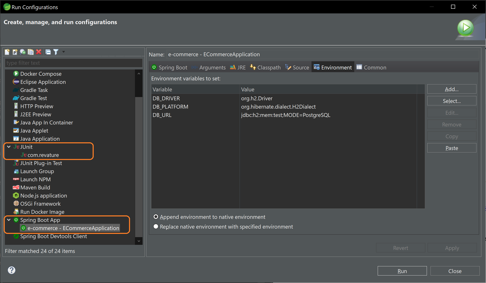

## E-Commerce Application

### Application to buy Revature Swag. 

This application is a functional website written in Java and typescript. It will allow users to register and select from listed products for purchase, add them to the cart, and check out. If a user forgets their password they can have it reset. A guest or user can look at products and get a pop up view of the item, and its discription. The user or guest can see how many of a product are in stock. The user or guest can search items by key word.

Working application can be found here:
### `https://production.dcs2jw2334qwo.amplifyapp.com/`

## Install Instructions for developers
- Helpful Technology
  - JDK 
  - Spring
  - Docker
  - NODE
  - Maven

This application can be downloaded to your local machine by running the command
### `git clone https://github.com/revature-rss-adam-1300/e-commerce-backend.git`
-----------
Next, assure you have the front end code by running 
### `git clone https://github.com/revature-rss-adam-1300/e-commerce-frontend.git`

in another folder. It is important to keep the front and back ends in separate directory locations.

-----------
To prepare the enviornment, in the project back end directory, enter the command
### `mvn install`

Then, navagate into the `target` directory, and run the command:
### `mvn spring-boot:run`
which will run the Spring enviornment

The enviornment will be limited to the test data contained in this source code. 

----------
To run the front end, navigate to its directory and run the command:
### `npm install`
After that, running the command:
### `npm start` 
within the directory will open the application in your browser. 

----------
## Docker instructions
To download the image from docker, enter the command:
### `docker pull murryf/e-commerce`

in the directory of your choosing. Open with your Docker desktop and run as a containerized image.

----------
## Eclipse / Spring Tool Suite IDE Instructions
**1) Setting up Lombok in your IDE.**

This project has Lombok as a maven dependency:

	<dependency>
		<groupId>org.projectlombok</groupId>
		<artifactId>lombok</artifactId>
		<optional>true</optional>
	</dependency>

Lombok autogenerates boilerplate code. In this project we use it to generate our getter and setter methods, which could upset your IDE.

You will need to install Lombok in your IDE. [Here is a good tutorial from Baeldung.](https://www.baeldung.com/lombok-ide)

After using the lombok installer, you might still need to do this:
1. Restart Eclipse
2. Project > Clean
3. Project > Update Maven Project

**2) Setting up environment variables**

**You will need to set it up twice: once for the Spring Boot App run configurations, and a second time for the JUnit test run configurations**

Since our project uses a different database setup on the kubernetes cluster, we use environment variables to configure the database. This means you will need to set the environment variables to run the project locally.

The following variables are for an in memory database:

<table>
    <tr>
        <td><b>Variable Name</b></td>
        <td><b>Value</b></td>
    </tr>
    <tr>
        <td>DB_PLATFORM</td>
        <td>org.hibernate.dialect.H2Dialect</td>
    </tr>
    <tr>
        <td>DB_URL</td>
        <td>jdbc:h2:mem:test;MODE=PostgreSQL</td>
    </tr>
    <tr>
        <td>DB_DRIVER</td>
        <td>org.h2.Driver</td>
    </tr>
</table>

You can find your environment variables in:

> Eclipse IDE > Run > Run Configurations > Select your Spring Boot App or JUnit configuration > "Environment" tab

Screenshot for reference:

## Happy coding!
